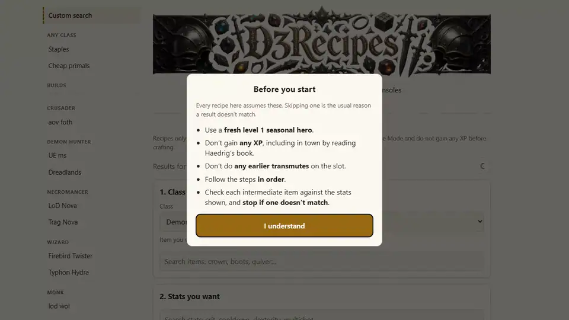

<p align="center">
  
</p>

<p align="center">
  <b>Targeted crafting recipes for Diablo III on consoles.</b><br>
  Pick an item, get a primal.
</p>

<p align="center">
  <a href="https://fngarvin.github.io/d3recipes/">Open the site</a> &middot;
  <a href="#requesting-a-build-preset">Request a build</a> &middot;
  <a href="#changelog">Changelog</a> &middot;
  <a href="LICENSE">License</a>
</p>

<p align="center">
  
</p>

---

A recipe finder for **Kanai's Cube** in offline Diablo III on consoles. Pick an item and the stats you care about and it attempts to create a recipe that can reliably produce it using a brand-new seasonal hero. You can, of course, use generated items on any hero.

The tool runs entirely in the browser (Rust compiled to WebAssembly), so it works even on a phone and needs no server.

## Using It

Open the site (`web/index.html` served by any static server, or the [GitHub Pages deployment](https://fngarvin.github.io/d3recipes/)), then:

1. Pick softcore or hardcore and season number (default: softcore, season 40).
2. Select a class, an item, and (optionally) a set of affixes.
3. Optionally, expand the Costs and Limits section to define the scope of the search.
4. Press **Find Recipes**.

**IMPORTANT**: Recipes assume a fresh level-1 seasonal hero that has performed no previous transmutes and has gained no XP. Even just entering campaign before joining adventure mode or reading Haedrig's book can be enough to break a recipe.

## How It Works

This tool mimics the way the game generates items so that every result can be computed in advance.

## Requesting a Build Preset

Copy the block in `builds_template.toml`, fill in your collection of items (items per slot, stats best-first) and either open an issue with it or add it to the end of `builds.toml` in a pull request. Quality builds submitted in a format that can be pasted straight into that file will be considered and pull requests against it are welcome for good builds or useful collections of items.

## Layout

| path | what |
| --- | --- |
| `web/` | the static site (`index.html`, `app.js`, `builds.js`, `recipe.js`, `stats.js`, `worker.js`, `icons/`), the game tables (`data.json`), the prepared recipes (`premade_sc.json`, `premade_hc.json`) and the compiled WebAssembly (`pkg/`) |
| `core/` | the Rust crate: model (`sim.rs`), search (`plan.rs`), table loading (`data.rs`), wasm interface (`lib.rs`) and tests |
| `testdata/` | expected results used by the tests |
| `docs/` | the README banner and demo |
| `builds.toml` | the list of precomputed builds (items and stat priorities per slot) |
| `builds_template.toml` | copy-paste form for requesting a build |

Build the wasm after changing `core/`:

```
cd core
cargo test --release
wasm-pack build --release --target web --out-dir ../web/pkg
```

Serve locally: `python -m http.server 8765 -d web` and open `http://localhost:8765`.

## Changelog

**2026-10-08**

- Custom search may now create any item as any class, class items included. Each class's Hope of Cain follows its own sequence, so another class creating the item (then handing it over for the later steps) is often cheaper: a Wizard's Firebird's Eye with Arcane Power on Critical Hit, Critical Hit Chance and Cooldown Reduction dropped from 21.25 (one stat short, finished at the Mystic) to 14.5 with every stat, and Firebird's Talons from 28.5 to 27.25. It counts as one hero swap; set "Most hero swaps" to 0 to keep everything on one class. The prepared lists already worked this way.
- Custom search can use Angelic Crucibles in the seasons that have them (Light's Calling: Season 27, 34, 40, and every sixth season after, going by the season-theme rotation). Sanctifying rolls the same affixes as Improve Legendary; on an item with six affixes the seasonal power takes the place of the last one, which also changes what the next cube step gives, so a crucible partway through a recipe can lead to a cheaper one. Under Costs and Limits, **Sanctification** sets its price (5 by default, the same as Reforge) and **Most Sanctifications** limits it per recipe (2 by default in those seasons, 0 elsewhere; it can still be turned on in other seasons for testing, with a warning). A recipe never ends on a crucible, since only one sanctified item can be worn, but crafted-primal results note that one can stand in for the last Improve Legendary. Confirmed in game: 15 Sanctifications in a row on an Accursed Visage and on a Karlei's Point, others by a hero of another class, a seven-step route to a primal Hell Walkers, and The Compass Rose predicted blind.
- Fixed Improve Legendary by a hero of another class on a class item (a Demon Hunter upgrading a Crusader's belt): it takes one extra draw, as Reforge and Convert Set Item already did, so the steps after it come out differently. Confirmed in game, the last two blind: a Demon Hunter's helm, dagger and quiver upgraded by a Barbarian, a Vigilante Belt (eight steps) and a Band of Might (seven). The prepared builds are regenerated with it: 6 softcore and 5 hardcore rows changed.
- Fixed custom search, the prepared builds and the salvage page sometimes missing a cheaper recipe when two routes led to the same item: the first one found won even when the other was cheaper. Most of the salvage page got cheaper (29 of 88 entries), and a few searches did too.
- Thanks to Ainahir for all of it, and for the care that went into it: every rule above came with in-game tests on a whole sequence of results, the cross-class Improve Legendary bug was found and pinned down along the way, and details like the crucible's own material icon were not forgotten (#7).
- Hovering over **Most Sanctifications** now explains it: 0 turns Sanctification off whatever its cost, and an empty box means no limit. Thanks to Ainahir (#15).
- Fixed weapons' on-hit crowd-control chances (Fear, Stun, Chill, Slow and so on) showing internal names such as "Weapon Hit Fear1h" in the stat list, and their values as 0: they now read "Chance to Fear on Hit" and show as percentages, like the same chances on other items. Damage against Beasts and against Undead (Monster Hunter, Corrupted Ashbringer) and Halcyon's Ascent's power ("Mesmerize on Archon" for a Wizard, and so on) got proper names too. Thanks to Ainahir (#14).

<details>
<summary><b>2026-10-07</b></summary>

- Life per Hit, Life Regeneration, Life after Each Kill and Life per Fury Spent now show the number the game shows. The game cuts these big values down to a multiple of 2, 4, 8, 16 or 32 depending on size (Life per Hit 8,796 shows as 8,792, Life after Each Kill 17,385 as 17,376); the page used to cut every one of them to a multiple of 16, which was wrong below 16,384.
- Custom search now has a **Primal only** box next to "Stats you want". Ticked, it looks for natural primals alone (no Improve Legendary, ancient or plain legendary results), so the whole time limit goes to them; it is kept in the search link and in saved searches.
- The minimum for each wanted stat is now checked against the item: the box can't go below 0 or above the highest roll the item can have (Critical Hit Chance on an amulet tops out at 10%), and a typed number outside that is pulled back to the nearest roll the item can have, instead of silently searching for something impossible. Thanks to Rwede for both suggestions.
- Fixed custom search not offering a Stone of Jordan's maximum-resource line (Maximum Discipline for a Demon Hunter, Fury for a Barbarian, and so on) under "Stats you want", although the ring rolls it. The list now includes what the game's last fixed-slot pass can pick. Thanks to Ainahir for finding it and tracing the cause (#12).

</details>

<details>
<summary><b>2026-10-06</b></summary>

- Fixed custom search showing recipes for the wrong item: for a set item, a Convert Set Item step could end the route on another piece of the set (a search for a chest could return shoulders), and the recipe was listed as if it made the item asked for. Every recipe now ends on the item you searched for. Thanks to Stroold and Rwede on Discord for documenting the bug.
- Fixed custom search suggesting Mystic rolls the item can't take. The Mystic now follows the same rules as the game's rolls: no All Resistance next to a single resistance, no Life per Hit next to Life per Kill, one skill-damage line, and so on. Thanks to szymonos for the detailed report. (The prepared builds still show a few such steps until they are regenerated.)
- Custom search finds cheaper recipes for set items: a recipe can now start from any piece of the set (for example, craft pants and Convert Set Item into the helm you want), as the prepared builds already did. On the set items in the prepared builds that use Convert, custom search now finds a cheaper recipe for 45 of 59 and the same for the rest.
- Custom search no longer limits how many times Improve Legendary is used; its price already does.
- The prepared builds are now generated by the same engine as custom search, at the page's prices (they were ranked at old placeholder prices that made Reforge look almost free). The recipes cost about 23% less in total, and 181 of 236 rows got cheaper. Thanks to szymonos for spotting it.
- The prepared builds' Mystic steps follow the game's rules: the Mystic replaces a line ranked below the stat it adds, never the weapon damage range, and never in a way the item can't roll. The few recipes that relied on an impossible Mystic step changed, and a row whose item has no room for its Mystic stat now says so.
- "Before you start" now mentions unlocking primals first: a solo Greater Rift 70 on another hero of the same season and mode.
- Changing the season or mode now clears custom search results already on screen, which were for the old season and mode; search again to see the new ones. Thanks to szymonos (#1).
- Custom search can hand the item to heroes of other classes between cube steps (a throwaway level 1 of any class will do). The item keeps its seed from hero to hero; the hero's class changes what an item of no class rolls, and a Reforge by a hero of another class than a class item's takes one extra draw. Each step then says which hero does it. Under Costs and Limits, **Most hero swaps** limits the hand-overs per recipe (0 by default; more can find cheaper recipes but makes the search much slower) and **Hero swap** sets what one costs, next to the other step costs. Confirmed in game on a class item (a Crusader's Vigilante Belt, six hand-overs); hand-overs on items of no class, where the class changes the affix weights, are not confirmed yet. Thanks to szymonos.
- A primal worn item (ring, amulet, helm, chest, pants, cloak or class head) that can have a socket now always gets it: its first primary pick lands the socket and the picks after it follow from that. Confirmed in game on a Squirt's Necklace, a Stone of Jordan (natural and Improve Legendary) and an Andariel's Visage; off-hands keep the ordinary roll (two primal sources, Etched Sigil and Firebird's Eye, had none). Ring of the Zodiac, whose primaries are all fixed, never gets one. The prepared lists, staples and salvage page are regenerated with it (41 recipes changed). Thanks to szymonos for finding it.
- When no recipe can roll every stat a prepared row asks for (an Andariel's Visage's only free primary is taken by its socket), the Mystic adds the lowest-ranked one instead: the lod nova helm now ends "+ Mystic: Blood Nova.
- Custom search's Mystic step also checks the kind from the game data (Crowd Control Reduction is a secondary) and the enchanting hero's class: a Necromancer never rolls Lightning damage, so a hero of another class enchants when that finishes the item, and the step says who. A recipe the Mystic cannot finish no longer ends the search ahead of one it can, and the step names the lines to swap ("Mystic: Cooldown Reduction or Armor (bonus) → Vitality"). Thanks to szymonos.
- The staples and the "cheapest primal for salvage" page are now generated by the same engine at the page's prices, like the prepared builds.
- Custom search has a **Most converts** setting under Costs and Limits: the most Convert Set Item steps in one recipe (2 by default, empty for no limit). Converting is cheap, so more of them can find cheaper set items but make the search much slower.
- Tests now run automatically on every push and pull request.
- Staples now include the three follower tokens that make the follower unable to die: Enchanting Favor (Templar Relic), Smoking Thurible (Enchantress Focus) and Skeleton Key (Scoundrel Token). Any legendary of the slot will do, so each is a few Hope of Cain casts on a rare token.

</details>

<details>
<summary><b>2026-10-05</b></summary>

- Custom search can now ask for a Socket (any item that can roll one; weapons never do). Thanks to the guys on the Diablo Seasonal Database Discord for the suggestion.
- The Mystic step now just says which stat to roll, and a "finish at Mystic" result is offered only when the item has a spare line of the same kind (primary or secondary) to swap out. The weapon damage range never counts.
- Custom search results now have a link: the address bar always holds your request with its season and mode (for example `s=40&m=sc`), so you can bookmark it or paste it in chat, and edit the season or mode in the address to see it for another one. **Copy link** copies it.
- **Save** keeps a search in a Saved list under Custom search. **All saved** shows every saved search computed for the season and mode chosen at the top; change them and press Recompute to refresh the whole list. Saved searches stay in your browser only.
- The prepared builds are hidden when the selected season has none (only season 40 has them); custom search works for any season.

</details>

<details>
<summary><b>2026-10-04</b></summary>

- Fixed natural primal weapons: they never roll a socket, and a socket slot left open is replaced by an extra primary affix. The last Reforge of a weapon route now gives the affixes the game gives. Thanks to szymonos for documenting the bug.
- Fixed the prepared builds' stat values for non-primal items. The rolls built into an item itself (such as a shield's) were skipped, so the "stop on" numbers and the cheaper legendary and ancient stop-offs were off. Which affixes an item gets, and every primal result, were already correct. Thanks to szymonos for documenting the bug.
- The Mystic suggestion no longer picks a weapon's damage range to reroll, and picks the main stat only when nothing else is spare.

</details>

## License

See [LICENSE](LICENSE). In short: use it however you like, credit the source, and if you use its outputs in a user-facing application, visibly link to the site or this repository. That applies to modified versions too.

## Thanks

Thank you to Blizzard Entertainment for thirty glorious years of Diablo; to jester, whose d3hack made it possible to test seasons offline; and to Maxroll, whose build guides the stat priorities in `builds.toml` are drawn from.
